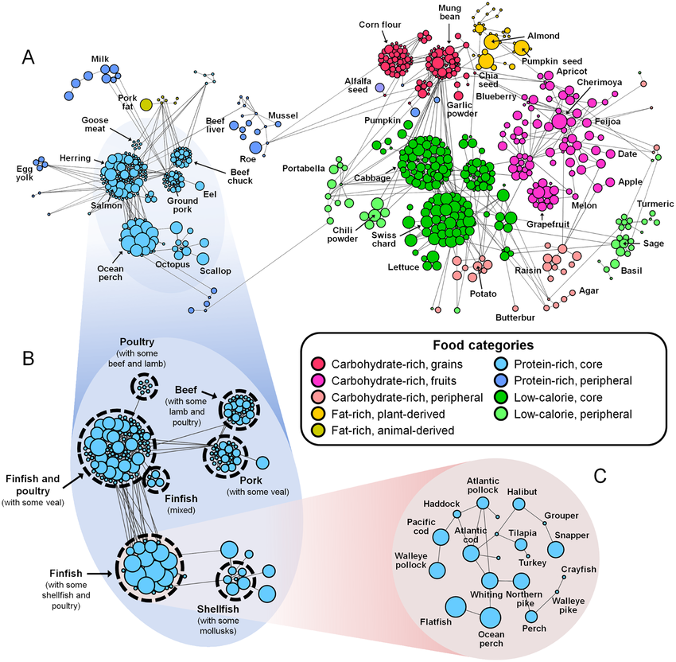

[Data Commons](../)

# Healthy Food

Goal 2. Healthy Food, No Hunger - [balance repo](/balance/)

[Data.world nutrition data for raw fruits, vegetables](https://data.world/adamhelsinger/food-nutrition-information) - from Rakesh

TO DO: Create 3D Force-Directed Graph mockup for the [Uncovering the Nutritional Landscape of Food](https://www.researchgate.net/figure/The-nutrient-nutrient-network-Each-node-represents-a-nutrient-and-nodes-are-connected_fig4_264826549) visualizations below (we will then contact researches to get data) - In the nutrient-nutrient network. Each node represents a nutrient, and nodes are connected through correlations between abundances of nutrients across all foods. The network is composed of three major groups of nutrients densely connected to one another through positive correlations. 

The shape of each node indicates a hierarchical or ‘taxonomic’ level of a nutrient, from ‘ Highest ’ (a general class of nutrients) to ‘Lowest’ (a specific nutrient). Color and thickness of each link correspond to the sign and magnitude of the correlation, respectively. Seven nutrients are omitted which don’t have significant correlations with any others. We also omit amino acids, because their correlations with other nutrients are very similar to correlations of total protein with others, and thus redundant for visualization.

## Food Nutrition Labels (YAML locally)

TO DO: Integrate with [Nutritionix Label](https://dev2.nutritionix.com/html/label-jquery-plugin/demo/2018-version/demo.html)

Source: [USDA API](https://fdc.nal.usda.gov/api-guide.html)

In the "fdc" subfolder we have two yaml samples for each of the 5 food groups (protein, dairy, vegetable, fruit, grains)

**Protein**  
[CHICKEN THIGH](/io/template/parser/#yaml=/data-commons/docs/food/fdc/samples/1899680.yaml)  
[CHEDDAR CHEESE](/io/template/parser/#yaml=/data-commons/docs/food/fdc/samples/2015943.yaml)  

**Dairy**  
[MILK](/io/template/parser/#yaml=/data-commons/docs/food/fdc/samples/2501185.yaml)  
[SPINACH](/io/template/parser/#yaml=/data-commons/docs/food/fdc/samples/2099349.yaml)  

**Vegetable**  
[TOFU](/io/template/parser/#yaml=/data-commons/docs/food/fdc/samples/2294522.yaml)  
[Lettuce, raw](/io/template/parser/#yaml=/data-commons/docs/food/fdc/samples/2345309.yaml)  

**Fruit**  
[APPLE](/io/template/parser/#yaml=/data-commons/docs/food/fdc/samples/2117388.yaml)  
[CHERRY](/io/template/parser/#yaml=/data-commons/docs/food/fdc/samples/2135570.yaml)  

**Grains**  
[SPAGHETTI](/io/template/parser/#yaml=/data-commons/docs/food/fdc/samples/2099117.yaml)  
[RICE](/io/template/parser/#yaml=/data-commons/docs/food/fdc/samples/356554.yaml)  

## Specific Food Profiles (JSON directly from FDA API)

Each food's nutrition data path is passed to our Feed-Player:

[Apple](/feed/view/#path=https://api.nal.usda.gov/fdc/v1/food/2117388?api_key=bLecediTVa2sWd8AegmUZ9o7DxYFSYoef9B4i1Ml)  
[Spinach](/feed/view/#path=https://api.nal.usda.gov/fdc/v1/food/2099349?api_key=bLecediTVa2sWd8AegmUZ9o7DxYFSYoef9B4i1Ml)  
[Cheddar Cheese](/feed/view/#path=https://api.nal.usda.gov/fdc/v1/food/2015943?api_key=bLecediTVa2sWd8AegmUZ9o7DxYFSYoef9B4i1Ml)  